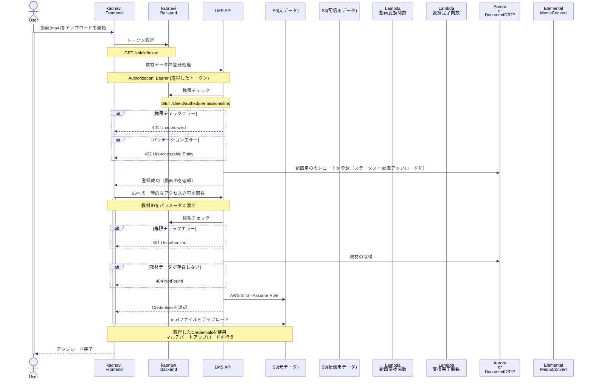

# 動画アップロードのフロー

```mermaid
sequenceDiagram
    actor User as User
    participant Client as kaonavi<br>Frontend
    participant Server as kaonavi<br>Backend
    participant API as LMS API
    participant S3_origin as S3(元データ)
    participant S3_deliv as S3(配信用データ)
    participant Lambda1 as Lambda<br>動画変換関数
    participant Lambda2 as Lambda<br>変換完了関数
    participant DB as Aurora<br>or<br>DocumentDB??
    participant MC as Elemental<br>MediaConvert

    User->>Client: 動画(mp4)をアップロードを開始
    activate User
        Client->>Server: トークン取得
        Note over Client,Server: GET /shield/token

        Client->>API: 教材データの登録処理
        Note over Client,API: Authorization: Bearer {取得したトークン}

        API->>Server: 権限チェック
        Note over Server,API: GET /shield/authed/permissions/lms
        alt 権限チェックエラー
            API-->>Client: 401 Unauthorized
        end
        alt バリデーションエラー
            API-->>Client: 422 Unprocessable Entity
        end
        API->>DB: 動画用ののレコードを登録（ステータス = 動画アップロード前）
        API-->>Client: 登録成功（動画IDを返却）

        Client->>API: S3への一時的なアクセス許可を取得
        activate Client
            Note over Client,API: 教材IDをパラメータに渡す
            API->>Server: 権限チェック
            alt 権限チェックエラー
                API-->>Client: 401 Unauthorized
            end
            API->>DB: 教材の取得
            alt 教材データが存在しない
                API-->>Client: 404 NotFound
            end
            API->>S3_origin: AWS STS - Assume Role
            API-->>Client: Credentialsを返却

            Client->>S3_origin: mp4ファイルをアップロード
        deactivate Client

        Note over Client,S3_origin: 取得したCredentialsを使用<br>マルチパートアップロードを行う
        Client-->>User: アップロード完了
    deactivate User
```
