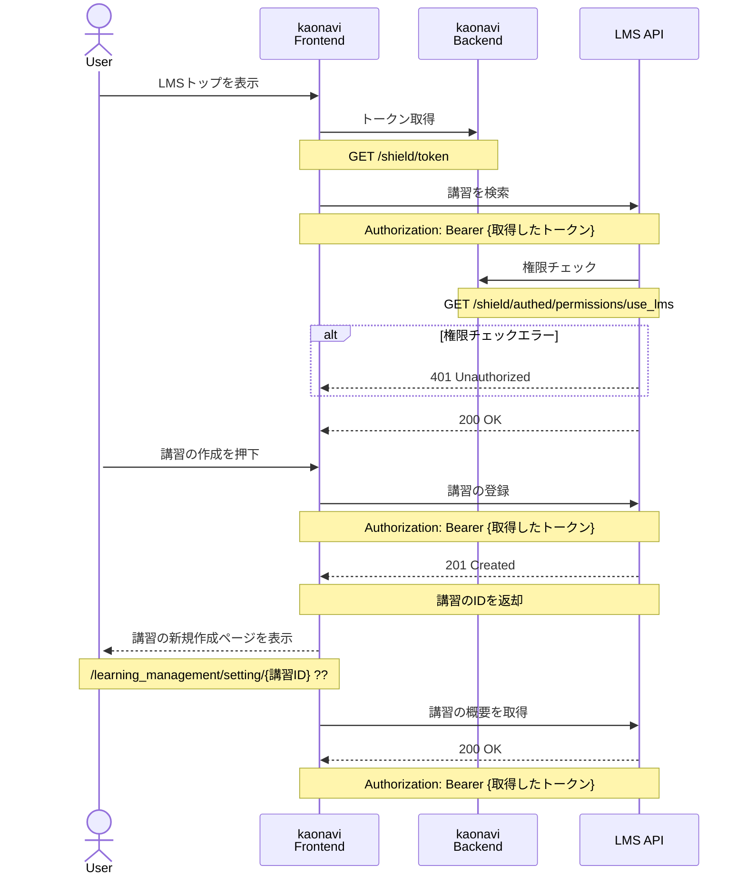

# トップ表示 -> 講習作成のフロー

```mermaid
sequenceDiagram
    actor User as User
    participant Client as kaonavi<br>Frontend
    participant Server as kaonavi<br>Backend
    participant API as LMS API

    User->>Client: LMSトップを表示
    activate User
    Client->>Server: トークン取得
    Note over Client,Server: GET /shield/token

    Client->>API: 講習を検索
    Note over Client,API: Authorization: Bearer {取得したトークン}
    API->>Server: 権限チェック
    Note over Server,API: GET /shield/authed/permissions/use_lms
    alt 権限チェックエラー
        API-->>Client: 401 Unauthorized
    end
    API-->>Client: 200 OK


    User->>Client: 講習の作成を押下
    Client->>API: 講習の登録
    Note over Client,API: Authorization: Bearer {取得したトークン}
    API-->>Client: 201 Created
    Note over Client,API: 講習のIDを返却

    Client-->>User: 講習の新規作成ページを表示
    Note over User,Client: /learning_management/setting/{講習ID} ??

    Client->>API: 講習の概要を取得
    API-->>Client: 200 OK
    Note over Client,API: Authorization: Bearer {取得したトークン}
```
