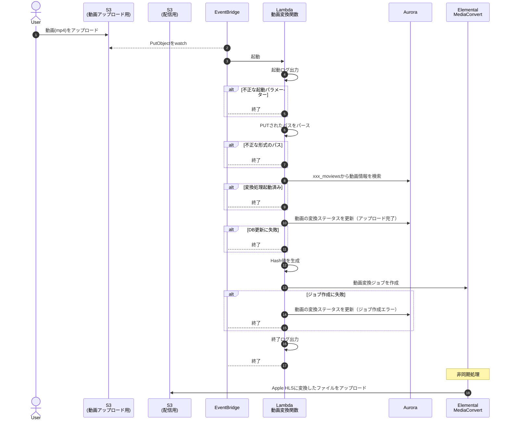

# convert - 動画変換関数の処理フロー

### 起動ログ

以下の項目を出力する

- `detail.id`
- `detail.object.key` いる？
- `detail.object.size` いる？

### 起動パラメーター

https://docs.aws.amazon.com/ja_jp/AmazonS3/latest/userguide/ev-events.html

**起動パラメーターの検証**

- `detail.reason` が `PutObject` であること
- `detail.object.key` に値が存在すること

### PUTされたパスをパース

パスのフォーマットは `users/{顧客コード}/{動画ID}/ファイル名.mp4`

### 変換処理起動済み

動画の変換ステータスが `アップロード完了` 移行のステータスの場合は処理をスキップ

変換処理が複数回呼ばれると不要な動画が作成されてコスト増につながるため。

### 動画変換ジョブを作成

SDK: https://pkg.go.dev/github.com/aws/aws-sdk-go-v2/service/mediaconvert

※ジョブ作成を実行する際に、起動パラメータをログ出力すること

**MediaConvertの起動パラメータ**

- 変換フォーマット: Apple HLS
- 出力先のパス: `users/{顧客コード}/movies/{動画ID}/{hash値}.m3u8`
  - TODO: インデックスファイル名指定出来る？できなかったらどういう形式になるかは確認しておく
- コーデック: AVC
- フレームレート: 30fps
- 解像度: HD（解像度が720 ~ 1,080）くらい？
- TODO: その他パラメータは要調査
- Tags
  - Key=Customer
    Value=`{顧客コード}`

### 終了ログ

以下の項目を出力する

- `detail.id`
- 動画変換ジョブのID
