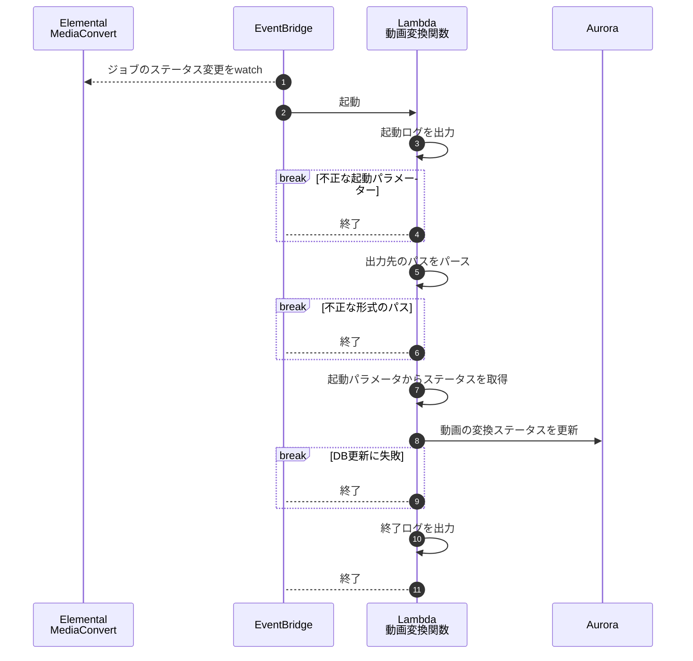

# statusmgmt - 動画変換ステータス管理関数の処理フロー

### 起動ログ

以下の項目を出力する

- `detail.id`
- `detail.job_id`

### 起動パラメーター

ステータス:
- https://docs.aws.amazon.com/ja_jp/mediaconvert/latest/ug/how-mediaconvert-jobs-progress.html
- https://docs.aws.amazon.com/ja_jp/mediaconvert/latest/ug/mediaconvert_cwe_events.html

起動パラメータ
- https://docs.aws.amazon.com/ja_jp/mediaconvert/latest/ug/apple-hls-group.html

**起動パラメーターの検証**

- `detail.status` に値が存在すること
- `detail.status` の値が以下のいずれかであること
  - TODO: 間違ってるかもしれないから後で直す
  - SUBMITED
  - PROGRESSING
  - COMPLETE
  - ERROR
  - CANCELED
- `detail.outputGroupDetails` が1件以上存在すること
  - TODO:
    - そもそも複数件来ることがある？
    - 複数ジョブ起動してたらまとめてイベントが飛んでくることもある？？
- `detail.outputGroupDetails.outputDetails` が1件以上存在すること
  - TODO:
    - そもそも複数件来ることがある？
    - 複数ジョブ起動してたらまとめてイベントが飛んでくることもある？？
- `detail.outputGroupDetails.outputDetails.outputFilePaths` が1件存在すること

### 出力先のパスをパース

パスのフォーマットは `users/{顧客コード}/movies/{動画ID}/{hash値}.m3u8`

### 動画の変換ステータスを更新

TODO: ステータス毎に対応するDB値を書く
TODO: ERRORの場合の起動パラメータを調べてエラーの詳細を記録するようにする
  - 多分 `detail.errorCode`と`detail.errorMessage`あたりが入るはず

**※DB更新に失敗した場合、後でリカバリ可能なように最低以下の情報は出力する**

- 顧客コード
- 動画ID
- `detail.status`
- ほかにある？
